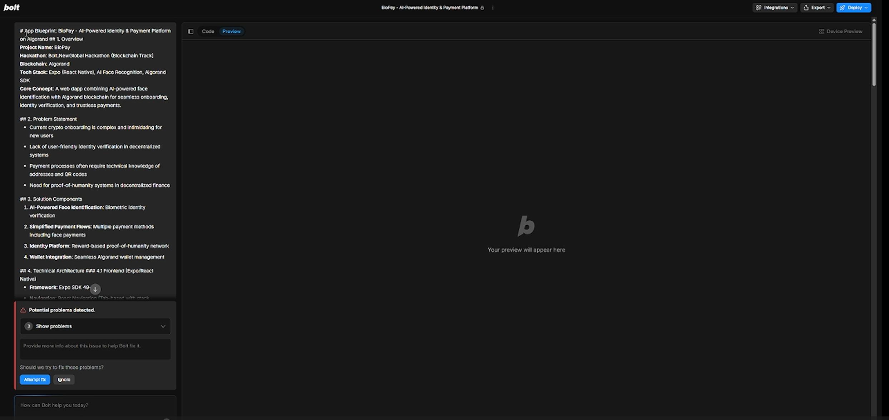
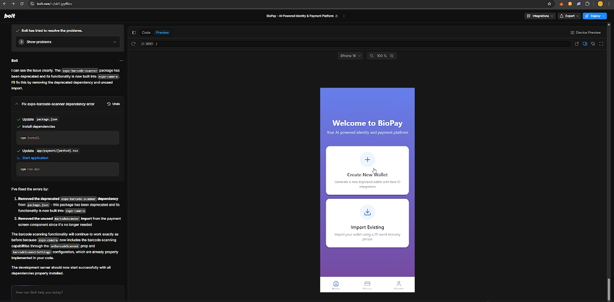
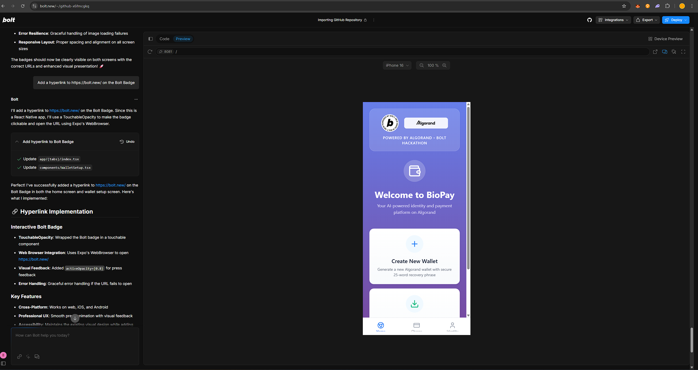

# BioPay - AI-Powered Identity & Payment Platform

BioPay is a cutting-edge mobile application built on the Algorand blockchain that combines AI-powered identity verification with seamless cryptocurrency payments. The app features biometric authentication, proof-of-humanity verification, and instant payment capabilities.

## 🚀 Features

### 🔐 Identity Verification
- **AI-Powered Face ID**: Secure biometric authentication using advanced AI
- **Proof-of-Humanity**: Blockchain-based identity verification system
- **Trust Score System**: Dynamic scoring based on verification level and activity
- **Reward Points**: Earn ALGO rewards for maintaining verification status

### 💳 Payment Solutions
- **Address Payments**: Send ALGO and ASAs to any Algorand address
- **QR Code Payments**: Instant payments via QR code scanning
- **Face ID Payment Requests**: Create authenticated payment requests using biometrics
- **Multi-Asset Support**: Support for ALGO, USDC, and other Algorand Standard Assets

### 🏦 Wallet Management
- **Secure Wallet Creation**: Generate new Algorand wallets with 25-word recovery phrases
- **Wallet Import**: Restore existing wallets using mnemonic phrases
- **Real-time Balance**: Live portfolio tracking with USD valuations
- **Transaction History**: Complete transaction history with detailed information

## 🛠 Technology Stack

- **Frontend**: React Native with Expo SDK 52
- **Navigation**: Expo Router 4.0
- **Blockchain**: Algorand SDK (algosdk)
- **State Management**: Zustand
- **UI Components**: Custom components with Lucide React Native icons
- **Camera**: Expo Camera for QR code scanning
- **Styling**: React Native StyleSheet with gradient effects

## 📱 Platform Support

- **Web**: Primary platform with full feature support
- **iOS**: Native mobile experience (requires development build)
- **Android**: Native mobile experience (requires development build)

## 🏗 Project Structure

```
app/
├── _layout.tsx              # Root layout with navigation setup
├── (tabs)/                  # Tab-based navigation
│   ├── _layout.tsx         # Tab bar configuration
│   ├── index.tsx           # Home screen with wallet overview
│   ├── charge.tsx          # Payment methods selection
│   └── identity.tsx        # Identity verification hub
├── payment/
│   └── [method].tsx        # Dynamic payment method screens
└── +not-found.tsx          # 404 error page

components/
├── AssetCard.tsx           # Cryptocurrency asset display
├── TransactionItem.tsx     # Transaction history item
└── WalletSetup.tsx         # Wallet creation/import flow

stores/
├── walletStore.ts          # Wallet state management
└── identityStore.ts        # Identity verification state

hooks/
└── useFrameworkReady.ts    # Framework initialization hook
```

## 🚀 Getting Started

### Prerequisites

- Node.js 18+ 
- npm or yarn
- Expo CLI

### Installation

1. Clone the repository:
```bash
git clone <repository-url>
cd biopay
```

2. Install dependencies:
```bash
npm install
```

3. Start the development server:
```bash
npm run dev
```

4. Open the app:
   - **Web**: Open http://localhost:8081 in your browser
   - **Mobile**: Use Expo Go app to scan the QR code

### Development Build (for native features)

For full native functionality including camera and biometrics:

```bash
# Install Expo Dev Client
npx expo install expo-dev-client

# Create development build
npx expo run:ios
# or
npx expo run:android
```

## 🔧 Configuration

### Environment Variables

Create a `.env` file in the root directory:

```env
EXPO_PUBLIC_ALGORAND_NODE_URL=https://mainnet-api.algonode.cloud
EXPO_PUBLIC_ALGORAND_INDEXER_URL=https://mainnet-idx.algonode.cloud
```

### Algorand Network

The app is configured for Algorand MainNet by default. For TestNet development:

1. Update the node URLs in your environment variables
2. Use TestNet dispensers for test ALGO
3. Update asset IDs for TestNet equivalents

## 🔐 Security Features

- **Client-side Key Storage**: Private keys never leave the device
- **Mnemonic Encryption**: Recovery phrases are securely stored
- **Biometric Authentication**: Face ID integration for payment requests
- **Transaction Signing**: All transactions signed locally
- **Network Security**: HTTPS-only API communications

## 🎨 Design Philosophy

BioPay follows Apple-level design aesthetics with:
- **Clean Interface**: Minimalist design with purposeful elements
- **Smooth Animations**: Micro-interactions and transitions
- **Consistent Theming**: Unified color palette and typography
- **Responsive Layout**: Optimized for all screen sizes
- **Accessibility**: WCAG compliant with proper contrast ratios

## 🧪 Testing

```bash
# Run tests
npm test

# Run linting
npm run lint

# Type checking
npx tsc --noEmit
```

## 📦 Building for Production

### Web Build
```bash
npm run build:web
```

### Mobile Build
```bash
# iOS
npx expo build:ios

# Android
npx expo build:android
```

## 🤝 Contributing

1. Fork the repository
2. Create a feature branch: `git checkout -b feature/amazing-feature`
3. Commit changes: `git commit -m 'Add amazing feature'`
4. Push to branch: `git push origin feature/amazing-feature`
5. Open a Pull Request

## BioPay Buildup!

Bolt.new buildup!

We first came across Bolt.new through the hackathon as my team and I are avid hackathoners. Then we decided to solve for that problem that was very difficult for us at that moment. Then the app we decided to create was planned accordingly.


We decided to code a web dapp with Expo that uses AI to create an identity platform that uses face identification for said platform and payments to empower the onboarding of new users that we think is the main problem of crypto at the moment.

The application would have first a login screen to set up your Algorand wallet, then a structure of three tabs with their respective screens. A home screen for your digital assets including USDC and most of the most important algorand-based tokens. Another screen would be the "Charge" one, which would have three buttons, one to pay with an algorand address, another one for the QR, and the last one to do face payments, with their respective screens also for each button for the face payment try not to develop it as much as I will connect an AI service to it. The last screen would be the identity platform based on Face-identification, with perks and a reward system as part of this proof of humanity network that we are building, in addition to a button to onboard users to the Face Identification network.

For the AI-face identification portion we would have to store a GPU enabled algorithmic system in a GPU-based server and hard-code that part as it is an additional system on top of the one we would do in bolt.

For the Bolt portion we would create the whole application, UI/UX, and even the Algorand SDK and smart contract inputs. 

Because of that, we consumed almost any documentation available, workshops and videos on how to prompt better in Bolt.new. This proved to be very successful for us as the first approach of the application ran correctly with this prompt:

### App Blueprint: BioPay - AI-Powered Identity & Payment Platform on Algorand

### 1. Overview
**Project Name**: BioPay  
**Hackathon**: Bolt.NewGlobal Hackathon (Blockchain Track)  
**Blockchain**: Algorand  
**Tech Stack**: Expo (React Native), AI Face Recognition, Algorand SDK  
**Core Concept**: A web dapp combining AI-powered face identification with Algorand blockchain for seamless onboarding, identity verification, and trustless payments.

### 2. Problem Statement
- Current crypto onboarding is complex and intimidating for new users
- Lack of user-friendly identity verification in decentralized systems
- Payment processes often require technical knowledge of addresses and QR codes
- Need for proof-of-humanity systems in decentralized finance

### 3. Solution Components
1. **AI-Powered Face Identification**: Biometric identity verification
2. **Simplified Payment Flows**: Multiple payment methods including face payments
3. **Identity Platform**: Reward-based proof-of-humanity network
4. **Wallet Integration**: Seamless Algorand wallet management

### 4. Technical Architecture

### 4.1 Frontend (Expo/React Native)
- **Framework**: Expo SDK 49+
- **Navigation**: React Navigation (Tab-based with stack navigators)
- **UI Libraries**: NativeBase or Tamagui for cross-platform components
- **State Management**: Jotai or Zustand
- **Algorand Integration**: algosdk.js

### 4.2 Backend Services
- **AI Face Recognition**: External API (to be integrated)
- **Algorand Node**: PureStake API or self-hosted node
- **Identity Platform Server**: Node.js backend for reward system

### 4.3 Smart Contracts
- **Algorand Smart Contracts** (TEAL/PyTeal):
  - Identity Verification Contract
  - Payment Escrow Contract
  - Reward Distribution Contract

### 5. Detailed Screen Flow

### 5.1 Authentication Flow
1. **Login/Signup Screen**
   - Algorand wallet creation/import (mnemonic or WalletConnect)
   - Face ID registration option
   - Basic profile setup

### 5.2 Main Tab Navigation

#### Tab 1: Home (Assets)
- **Dashboard Layout**:
  - Total portfolio value (USDC equivalent)
  - Asset cards (USDC, ALGO, ASAs)
  - Recent transactions list
  - Quick action buttons (Send/Receive)

#### Tab 2: Charge (Payments)
- **Payment Method Selection**:
  - Button 1: Address Payment
    - Screen: Address input field + amount + memo
  - Button 2: QR Payment
    - Screen: QR scanner + amount override
  - Button 3: Face Payment
    - Screen: Camera view for face recognition
    - Connects to AI service for verification

#### Tab 3: Identity Platform
- **Profile Section**:
  - Verification status (Verified/Unverified)
  - Trust score/rating
- **Rewards System**:
  - Points balance
  - Reward tiers
  - Claimable benefits
- **Onboarding Button**:
  - Starts face verification process
  - Explains proof-of-humanity benefits

### 6. Core Features Specification

### 6.1 Face Identification System
- Integration with external AI service (API specs TBD)
- Liveness detection
- Biometric template storage (encrypted, on-chain metadata)
- Verification levels (KYC-lite to full KYC)

### 6.2 Payment Flows
1. **Standard Payment**:
   - Algorand standard asset transfer
   - Transaction note for payment reference
2. **QR Payment**:
   - Generates payment request QR codes
   - Supports ASA-specific requests
3. **Face Payment**:
   - Matches face to registered identity
   - Resolves to Algorand address
   - Confirms payment with biometric

### 6.3 Identity Platform Features
- **Proof-of-Humanity**:
  - Unique human verification
  - Sybil attack resistance
- **Reward Mechanism**:
  - ALGO rewards for verification
  - Tiered benefits system
- **Network Effects**:
  - Referral bonuses
  - Verification milestones

### 7. Blockchain Integration

### 7.1 Algorand Components
- **Account Management**:
  - Mnemonic generation/import
  - Watch accounts
- **Asset Support**:
  - Native ALGO
  - USDCa (Algorand USDC)
  - Common ASAs
- **Transaction Building**:
  - Payment transactions
  - Asset transfer transactions
  - Application calls

### 7.2 Smart Contract Details
1. **Identity Registry**:
   - Stores verification status
   - Manages reputation scores
2. **Payment Escrow**:
   - Holds funds during face verification
   - Releases on successful match
3. **Reward Distributor**:
   - Manages incentive payouts
   - Tracks referral bonuses

### 8. Development Roadmap

### Phase 1: Core Functionality (Hackathon)
- [ ] Wallet creation/import
- [ ] Basic asset display
- [ ] Address and QR payments
- [ ] Face payment UI (mock API)
- [ ] Identity screen layout

### Phase 2: AI Integration
- [ ] Face recognition API integration
- [ ] Liveness detection
- [ ] Biometric template handling

### Phase 3: Advanced Features
- [ ] Reward system implementation
- [ ] Smart contract integration
- [ ] Referral program
- [ ] Multi-chain support

### 9. Hackathon Deliverables
1. Functional Expo app with:
   - Wallet management
   - Asset display
   - Basic payment flows
   - Face payment UI mock
2. Demo video showing:
   - User onboarding
   - Face verification
   - Payment flow
3. Pitch deck covering:
   - Problem/solution
   - Technical approach
   - Future roadmap

### 10. Additional Considerations
- **Security**:
  - Biometric data handling
  - Wallet security best practices
- **Compliance**:
  - Data privacy regulations
  - KYC implications
- **Scalability**:
  - Algorand's performance characteristics
  - Batch processing for rewards

### 11. Team Roles
- **Frontend Lead**: Expo/React Native implementation
- **Blockchain Dev**: Algorand integration
- **AI Specialist**: Face recognition integration
- **UX/UI Designer**: Interface and flows
- **Product Manager**: Feature prioritization

This blueprint provides comprehensive guidance for developing BioPay during the hackathon while allowing flexibility for the face recognition implementation to be connected to an external AI service as specified.


We have to mention that this works much more as a Blueprint of the project than a sole prompt.



We added then a couple adjustments to it:



And finally added the Algorand SDK and kits available that proved to be quite difficult to integrate into this Expo version but after several tries and error corrections by Bolt we were able to get running.


Finally we added the Badges to qualify it to the Hackathon.




## 📄 License

This project is licensed under the MIT License - see the [LICENSE](LICENSE) file for details.

## 🙏 Acknowledgments

- **Algorand Foundation** for the robust blockchain infrastructure
- **Expo Team** for the excellent development platform
- **React Native Community** for the comprehensive ecosystem
- **Lucide Icons** for the beautiful icon library

## 📞 Support

For support and questions:
- Create an issue in this repository
- Join our community Discord
- Email: support@biopay.app

## 🗺 Roadmap

- [ ] Multi-language support
- [ ] Advanced DeFi integrations
- [ ] NFT marketplace integration
- [ ] Cross-chain bridge support
- [ ] Enterprise API access
- [ ] Hardware wallet integration

---

Built with ❤️ using React Native, Expo, and Algorand
